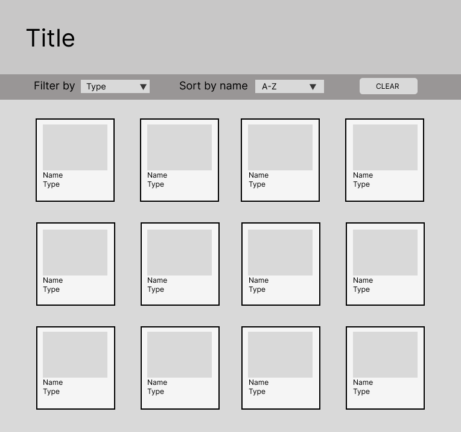

## 1. Definición del producto_ 
Se hizo una página web de peliculas Studio Ghibli, los usuarios pueden hacer un filtro de acuerdo los directores y productores, una vez elegido se puede ordenar de acuerdo al año o ranking de cada pelicula de una forma ascendente o descendente.
## 2. Historias de Usuarios_

  “Quiero conocer cuáles son las películas que ha producido Studio Ghibli y de qué tratan”
  “Busco una lista de las películas dirigidas por “xx” director en Studio Ghibli”
  "Quiero ver una lista de las películas publicadas por Studio Ghibli y poder ordenarlas por el año en el que fueron publicadas"
  "Teniendo una lista de las películas realizadas por Studio Ghibli, me gustaría conocer cuántos personajes y locaciones diferentes tiene cada película"
  
  ## 3. Prototipo
   Un _sketch_ de la solución (prototipo de baja fidelidad) y
  _Diseño de la Interfaz de Usuario_ (prototipo de alta fidelidad):
  Nos guiamos de este wireframe para pensar en nuestro prototipo
  
  Y acá esta nuestro prototipo de alta fidelidad https://www.figma.com/file/OGIDbJZ4YSv4sEJbYvVndd/Untitled?type=design&node-id=0%3A1&mode=design&t=jqjyvKv3b02mKPeL-1 
  ## 4. El listado de problemas que detectaste a través de tests
  de usabilidad:
  Al principio le habíamos puesto como fondo una imagen, notamos que sería mucha carga visual para el usuario ya que cada tarjeta tendría la imagen de cada pelicula, concluímos que sería mejor dejar un fondo de un tono claro y en el header una imagen.
  Tanto título, como algunas caracteristicas de las tarjetas estaba con un color que no hacía suficiente contraste con el fondo, se hacía incomodo de leer, se cambió el color y se puso un sombreado para darle mayor protagonismo.
  No estaba claro que las tarjetas al pasar el cursor se daban vuelta para mostrar más información, entonces se puso un mensaje antes de los select para informar de esto al usuario.
  
  